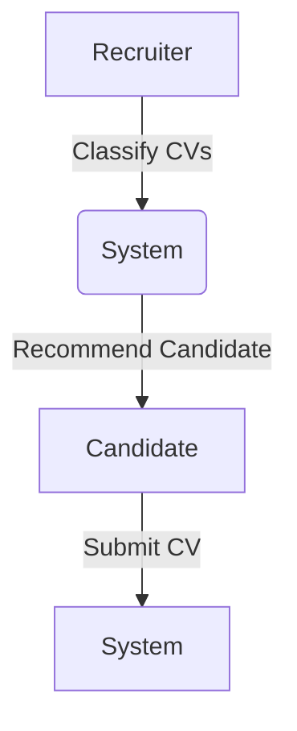
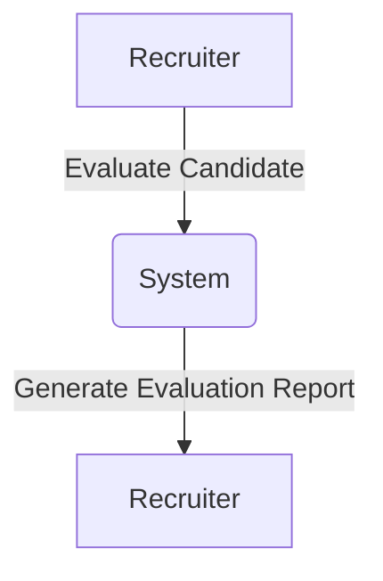
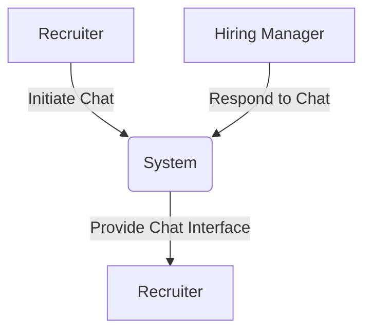
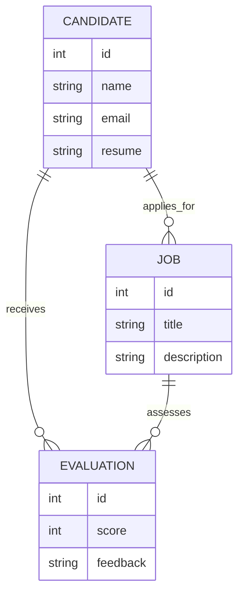
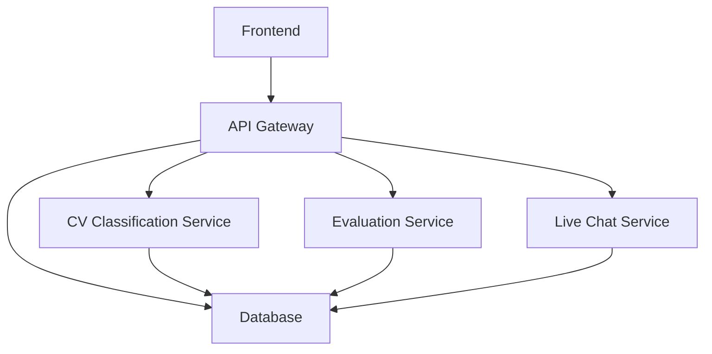
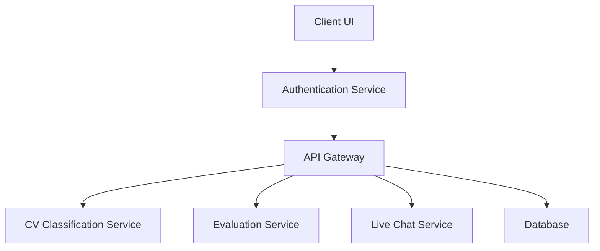

# Documentación del Sistema de Applicant-Tracking System (ATS) de LTI

## Índice

1. [Descripción del Software](#descripcion-del-software)
2. [Lean Canvas](#lean-canvas)
3. [Funciones Principales](#funciones-principales)
4. [Casos de Uso](#casos-de-uso)
    - [Caso de Uso 1: Clasificación Automática de CVs](#caso-de-uso-1-clasificacion-automatica-de-cvs)
    - [Caso de Uso 2: Evaluación Automatizada de Candidatos](#caso-de-uso-2-evaluacion-automatizada-de-candidatos)
    - [Caso de Uso 3: Chat en Vivo entre Reclutadores y Managers](#caso-de-uso-3-chat-en-vivo-entre-reclutadores-y-managers)
5. [Modelo de Datos](#modelo-de-datos)
6. [Diseño del Sistema a Alto Nivel](#diseno-del-sistema-a-alto-nivel)
7. [Diagrama C4 de Componentes](#diagrama-c4-de-componentes)

---

## Descripción del Software

LTI ATS es una plataforma diseñada para revolucionar el proceso de reclutamiento mediante un enfoque en la eficiencia, la colaboración en tiempo real, y la inteligencia artificial (IA). A diferencia de los ATS tradicionales, LTI ATS incluye una poderosa herramienta de chat en vivo para la comunicación fluida entre reclutadores y managers, además de una robusta suite de automatización y asistencia IA para tareas como la clasificación de CVs y la evaluación de candidatos.

---

## Lean Canvas

### Lean Canvas para LTI ATS (Primera Versión)

<table>
    <tr>
        <td colspan="2">Problem</td>
        <td>Customer Segments</td>
    </tr>
    <tr>
        <td colspan="2">
            <ul>
                <li>Reclutamiento lento y proceso manual de selección.</li>
                <li>Falta de colaboración en tiempo real entre equipos de reclutamiento.</li>
                <li>Dependencia alta en tareas administrativas de RH.</li>
            </ul>
        </td>
        <td>
            <ul>
                <li>Empresas medianas y grandes con necesidades de reclutamiento continuo.</li>
                <li>Equipos de reclutamiento internos y agencias de RH.</li>
            </ul>
        </td>
    </tr>
    <tr>
        <td colspan="2">Solution</td>
        <td>Unique Value Proposition</td>
    </tr>
    <tr>
        <td colspan="2">
            <ul>
                <li>Automatización de flujo de trabajo y recordatorios.</li>
                <li>Clasificación y recomendaciones automáticas mediante IA.</li>
                <li>Herramientas de colaboración en tiempo real (chat en vivo).</li>
            </ul>
        </td>
        <td>"El ATS que optimiza cada parte del proceso, desde la preselección hasta la contratación."</td>
    </tr>
    <tr>
        <td>Unfair Advantage</td>
        <td>Channels</td>
        <td>Revenue Streams</td>
    </tr>
    <tr>
        <td>
            <ul>
                <li>Asistencia avanzada de IA en tiempo real.</li>
                <li>Integración de análisis de tono en entrevistas.</li>
            </ul>
        </td>
        <td>
            <ul>
                <li>Alianzas con empresas de RH.</li>
                <li>Publicidad en redes sociales.</li>
                <li>Exhibiciones en ferias de tecnología de reclutamiento.</li>
            </ul>
        </td>
        <td>
            <ul>
                <li>Suscripción mensual por usuario.</li>
                <li>Tarifas personalizadas para grandes empresas.</li>
            </ul>
        </td>
    </tr>
    <tr>
        <td colspan="2">Key Metrics</td>
        <td>Cost Structure</td>
    </tr>
    <tr>
        <td colspan="2">
            <ul>
                <li>Tasa de cierre de vacantes.</li>
                <li>Tiempo promedio de contratación.</li>
                <li>Satisfacción de usuarios (reclutadores, managers).</li>
            </ul>
        </td>
        <td>
            <ul>
                <li>Costos de desarrollo y mantenimiento del software.</li>
                <li>Gastos de marketing y ventas.</li>
                <li>Infraestructura de servidores y almacenamiento en la nube.</li>
            </ul>
        </td>
    </tr>
</table>

---

## Funciones Principales

1. **Clasificación Automática de CVs**: Uso de IA para categorizar y recomendar candidatos.
2. **Evaluación Automatizada de Candidatos**: Procesos automáticos de evaluación con base en criterios predefinidos.
3. **Chat en Vivo entre Reclutadores y Managers**: Comunicación en tiempo real, asegurando una alineación rápida.

---

## Casos de Uso

### Caso de Uso 1: Clasificación Automática de CVs
**Descripción**: El sistema utiliza IA para clasificar CVs y recomendar a los mejores candidatos para posiciones específicas.

**Diagrama de Caso de Uso**:

### Caso de Uso 2: Evaluación Automatizada de Candidatos
**Descripción**: Automatización de evaluaciones, asignación de puntuación y creación de reportes.

**Diagrama de Caso de Uso**:

### Caso de Uso 3: Chat en Vivo entre Reclutadores y Managers
**Descripción**: Chat en tiempo real para discutir el progreso y la selección de candidatos.

**Diagrama de Caso de Uso**:

---

## Modelo de Datos

**Entidades y Atributos**:

---

## Diseño del Sistema a Alto Nivel

**Descripción**: Sistema de arquitectura modular con servicios independientes para IA, chat y administración de candidatos.

**Diagrama de Diseño**:

---

## Diagrama C4 de Componentes

**Descripción**: Desglose de componentes internos en el sistema.

**Diagrama C4**:

